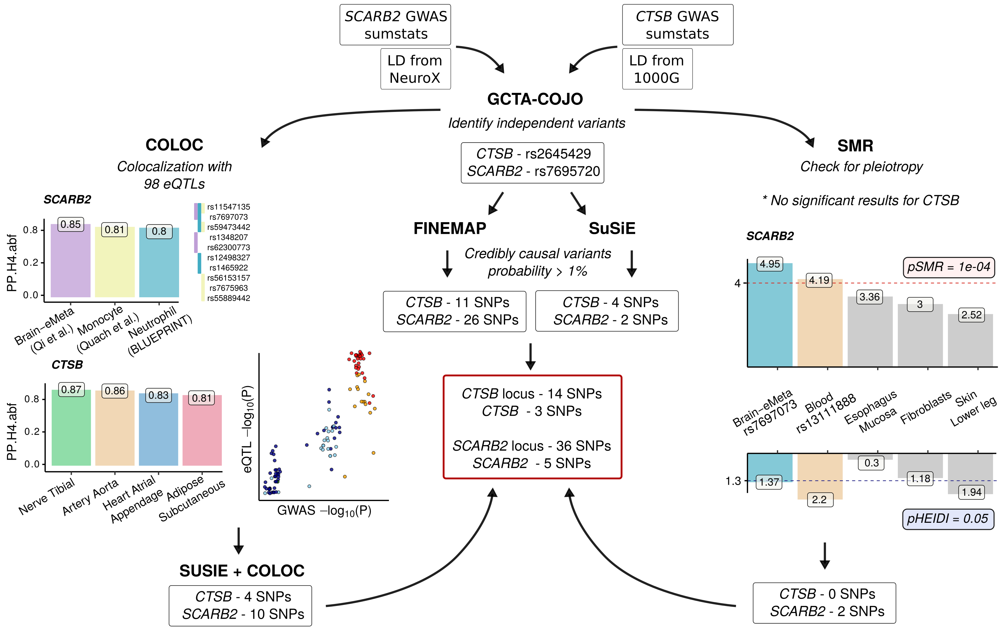
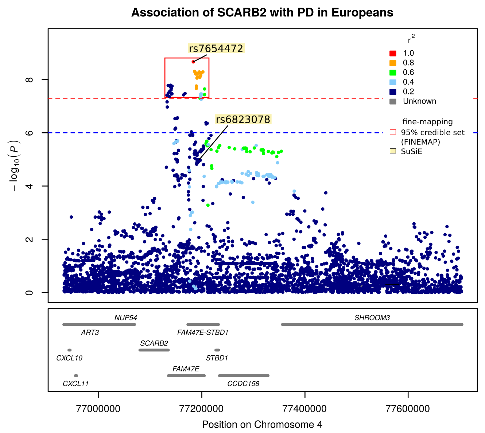
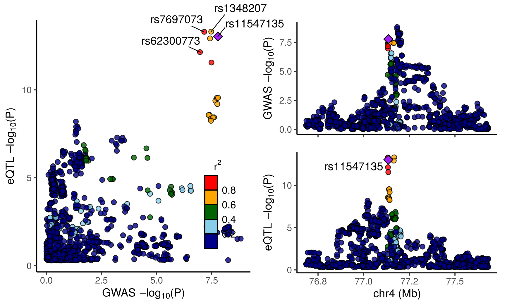
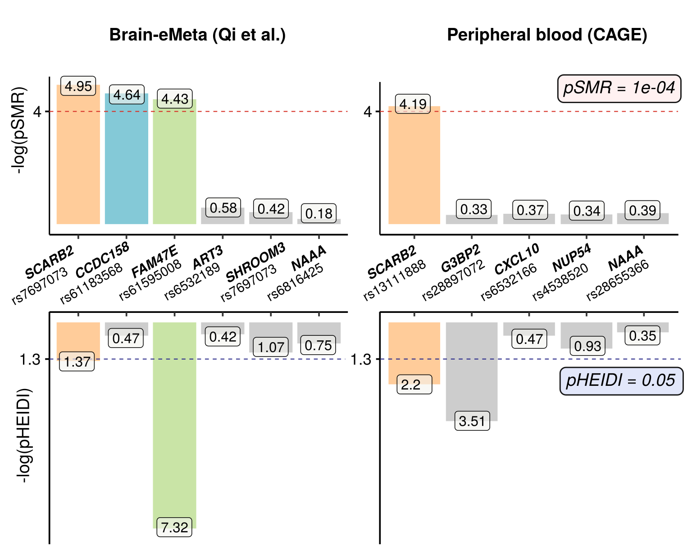

# Fine-mapping of SCARB2 and CTSB genes 

This project is aimed at identification of the most likely variants in SCARB2 and CTSB loci that drive the association with Parkinson's disease (PD) risk.

In order to perform this analysis further workflow was implemented:





In brief, we started from identification of independent variants with GCTA-COJO, following by statistical finemapping tools, such as FINEMAP and SuSiE. We continued with colocalization analysis via COLOC and Summary-based Mendelian Randomization (SMR). This approach allowed us to narrow down a number of the most likely SNPs that are responsible for asociation of these loci with PD risk.

## Requirements
* **R** (version > 3.6)
* **PLINK 1.9** (https://www.cog-genomics.org/plink/1.9/) *Chang CC, Chow CC, Tellier LCAM, Vattikuti S, Purcell SM, Lee JJ (2015) Second-generation PLINK: rising to the challenge of larger and richer datasets*
* **GCTA-COJO** (https://cnsgenomics.com/software/gcta/#Overview) *Yang et al. (2011) GCTA: a tool for Genome-wide Complex Trait Analysis. Am J Hum Genet. 88(1): 76-82*
* **SMR** (https://cnsgenomics.com/software/smr/#Overview) *Zhu Z, Zhang F, Hu H, Bakshi A, Robinson MR, Powell JE, Montgomery GW, Goddard ME, Wray NR, Visscher PM & Yang J (2016) Integration of summary data from GWAS and eQTL studies predicts complex trait gene targets.*
* **COLOC** (https://chr1swallace.github.io/coloc/index.html) *C Wallace et. al (2012) Statistical colocalization of monocyte gene expression and genetic risk variants for type 1 diabetes*
* **FINEMAP** (http://www.christianbenner.com/) *FINEMAP: Efficient variable selection using summary data from genome-wide association studies. Bioinformatics 32, 1493-1501 (2016)*
* **LocusZoom** ()
* **1000 Genomes project** (http://ftp.1000genomes.ebi.ac.uk/vol1/ftp/release/20130502/)


For correct work of all scripts required libraries should be installed in R:
```console
install.packages(c('optparse','RColorBrewer', 'data.table', 'dplyr', 'reshape', 'ggplot2', 'MASS', 'stringr', 'stats', 'tidyr')
```

## 1. Initial data

We used GWAS summary statistics of meta-analysis study of Parkinson's disease (https://pubmed.ncbi.nlm.nih.gov/31701892/). We defined loci as +-1000kb regions around SCARB2 and CTSB genes.

## 2. LD correlation matrix

For most steps of fine-mapping analysis proper LD refernce matrix is requiered. As far as we used meta-analysis data where individual-level genotype data are not available, we used one of the participating cohorts - IPDGC NeuroX. We also used publicly available data from 1000 Genomes Project (phase 3). It is not highly recommended because population structure may be slightly different, and a number of european samples is very small (503 participants). However we tested both variants and decided to use IPDGC-NeuroX for SCARB2 region and 1000G data - for CTSB, based on a number of shared SNPs between datasets.

In order to calculate LD matrix we firstly created .bed/.bim/.fam files from .vcf files for 4 and 8 chromosomes via PLINK 1.9:

(all examples are shown for 1 locus)

```console
plink --vcf ALL.chr4.phase3_shapeit2_mvncall_integrated_v5b.20130502.genotypes.vcf.gz --extract ctsb_1000kb_rs.tsv --make-bed --a2-allele ctsb_1000kb_rs_A2.tsv --keep eur_id.tsv --out ctsb_1000kb
```

```--a2-allele``` allows to set other allele in order to calculate LD matrix with regard to ref/alt alleles from summary statistics

Then we calculated LD matrix:

```console
plink --bfile 1000G_chr4 --extract scarb2_1000kb_rs.tsv --r2 square spaces sumstats_subsets/1000kb_windows/ctsb_1000kb_rs_A2.tsv --keep eur_id.tsv --out ./LD_reference/1000G_calculated_de_novo_matrix_1703/ctsb_1000kb
```

```--extract``` extract only SNPs in the locus

```--keep``` kepps only europeans by their ids (file with ids can be also found on ftp of 1000G)


## 3. Conditional analysis

After data preprocessing we applied stepwise conditioning using genome-wide complex trait analysis (GCTA) with determined LD reference, to identify independent signals at the studied loci:

```console
gcta64 --cojo-file sumstats_subsets/chromosomes/chr4_for_GCTA.tsv --bfile LD_reference/IPDGC_imputed/IPDGC_chr4 --cojo-slct --cojo-p 5e-5 --extract sumstats_subsets/1000kb_windows/scarb2_1000kb_chr_pos_min_maj_rsids.tsv --out gcta_output/SCARB2/chr4_IPDGC_scarb2_locus_gcta
```

## 4. Fine-mapping

We next applied statistical fine-mapping methods that are used to perform variable selection in multiple regression (y = Xb + e). 

FINEMAP and SuSiE are suitable to models where X variables are highly correlated, which is a key feature of GWAS results, where variants are highly correlated in LD-blocks. 

The output of the fitting procedures is a number of credible sets (cs), set of  variables that are each associated with the response and together can explain 95% of association of the locus with PD risk.

### FINEMAP

We ran FINEMAP with number of causal variants at each locus equals to the number of signals determined with GCTA:

```console
./finemap_v1.4_x86_64 --sss --in-files master --dataset 1 --n-causal-snps 1
```

* You can learn how to prepare files for FINEMAP here (http://www.christianbenner.com/)

### SuSiE

Next we applied SuSiE. Since it is a package in R, you can learn how to carry out this step in ```run_susie.html``` file.

The results of finemapping can be visualized with LocusZoom function ():



We can see that 1 independent variant was found in SCARB2 region (rs7654472). 95% credible set detected by FINEMAP is in red box, while SNPs predicted by SuSiE are highlighted with yellow.

## 5. Colocalization

Colocalization analysis aims at finding the association between variants and gene expression through detecting shared variants between GWAS and eQTLs data.

### COLOC

We applied colocalization analysis with ~100 datasets of eQTL data from different tissues. Some of them were downloaded and prepared manually. For them ```make_coloc.sh``` was written, which launched ```make_coloc.R``` and outputs a dataframe with colocalization results for esch gene in a locus. 

```console
./make_coloc.sh path_to_gwas path_to_dir_with_eQTLs output_path
```

**Args:**
1-path to GWAS sumstats
2-path to directory with eQTLs
3-output directory

Also it generates a list of SNPs that were found by COLOC to drive the colocalization as well as locus zoom plots for significant colocalizations.



Here we can see 4 SNPs that drive colocalization between SCARB2 region and  brain.

Sometimes we got a lot of SNPs predicted by coloc to be significant dreivers of colocalization. In order to resolve LD structure between them and find only credible set of SNPs that drive the association, we applied SuSiE+COLOC framework (see run make_coloc_susie.html)


### SMR 
SMR (Summary-based Mendelian Randomization) takes LD-structure into account and it’s results can be interpreted as possible pleiotropy between 1 causal variant and transcription and phenotype.

We used SMR with ~50 datasets using ```make_SMR.sh``` script. 

```console
./make_smr.sh path_to_LD path_to_gwas path_to_dir_with_eQTLs output_path
```
**Args:**
1-path to LD matrix
2-path to GWAS sumstats
3-path to directory with eQTLs
4-output directory

The results of this step can be visualized with histogram:



According to the SMR output, expression of 3 genes *SCARB2*, *CCDC158* and *FAM47E* in brain may be driven by single mutations in this region that are associated with PD. 

Note that *CCDC158* did not pass pHEIDI threshold, which means that more than one SNP may be responsible for the association.

In peripheral blood only *SCARB2* was found to be associated with both a single mutation and PD.

To sum it all up, we defined a SNP to be possible candidate variant if it's significance was shown by at least 1 method. We reduced the number of potential causal SNPs to 14 in the CTSB locus and 36 in the SCARB2 locus. Among them 5 variants are situated in SCARB2 gene, and 3 - in CTSB. All the variants belong to introns or UTR-regions.
