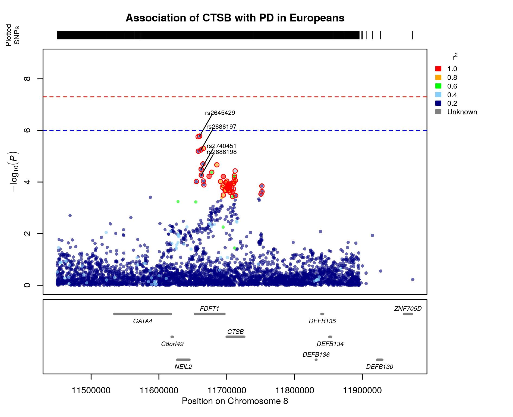

```{r setup, include=FALSE}
knitr::opts_chunk$set(echo = TRUE)
if (!require("dplyr")) install.packages("dplyr")
if (!require("susieR")) install.packages("susieR")
if (!require("coloc")) install.packages("coloc")
if (!require("magrittr")) install.packages("magrittr")
```

```{r echo = T, warning=FALSE, message=FALSE, eval=TRUE}
library(dplyr)
library(susieR)
library(coloc)
library(magrittr)
```

# Tutorial overview

This tutorial is aimed at running finemapping analysis with SuSiE in R.
We will need summary statistics file as well as precomputed LD matrix (it can be easily done with PLINK) and rs of SNPs from the matrix. Please, set your own paths for each file:

```{r}
gwas_path <- "/media/daria/DaryaNika/Fine_mapping/sumstats_subsets/ctsb_1000kb_window.tsv"
LD_path <- "/media/daria/DaryaNika/Fine_mapping/LD_reference/1000G_calculated_de_novo_matrix_1703/ctsb_1000kb_wo_rare.ld"
LD_rs_path <- "/media/daria/DaryaNika/Fine_mapping/LD_reference/1000G_calculated_de_novo_matrix_1703/ctsb_1000kb_wo_rare.txt"

gwas <- read.csv(gwas_path, sep = "\t")
LD_rs <- read.table(LD_rs_path)
LD <- read.table(LD_path, row.names = as.character(LD_rs$V1), col.names = as.character(LD_rs$V1))
```

Firsly let's format GWAS sumstats and LD matrix:
```{r}
# Replace NAs with 0 and turn LD into matrix
LD <- LD %>% replace(is.na(.), 0)
LD_matrix <- as.matrix(LD)

# Check for complete cases
gwas <- gwas[complete.cases(gwas), ]

# Check for cases with beta = 0
gwas <- gwas[gwas$b != 0, ]

# Select required variables
gwas <- gwas %>% 
  mutate(s = N_cases / (N_cases + N_controls), varbeta = se^2) %>% 
  dplyr::select(rsID, SNP, A1, A2, freq, b, se, p, bp, s, varbeta)
```

Now we can find beta of minor allele and minor allele frequency (MAF):

```{r}
# Find MA beta and MAF
gwas$b_MA <- gwas$b
gwas[gwas$freq > 0.50, ]$b_MA <- gwas[gwas$freq > 0.50, ]$b_MA *-1

gwas$MAF <- gwas$freq
gwas[gwas$freq > 0.50, ]$MAF <- 1 - gwas[gwas$freq > 0.50, ]$MAF
```

We can get rid of rare variants (maf < 1%) in order to improve quality of finemapping calculation. As we can see, there are 3631 common variants:

```{r}
# Select only SNPs with MAF >= 0.01 
gwas <- gwas[gwas$MAF >= 0.01, ]

nrow(gwas)
```

Finally we need to select only SNPs common for LD matrix and GWAS data
```{r}
gwas <- gwas[gwas$rsID %in% LD_rs$V1, ]
```

Now we can run SuSiE!

```{r}
named_beta <- extract2(gwas, 'b') %>% set_names(gwas$rsID)
named_varbeta <- extract2(gwas, 'varbeta') %>% set_names(gwas$rsID)

dataset1=list(beta=named_beta, 
              varbeta=named_varbeta, 
              s =gwas$s, 
              type="cc", 
              snp=as.character(gwas$rsID), 
              LD=LD_matrix, 
              position=gwas$bp)

check_dataset(dataset1)

S3=runsusie(dataset1, nref=503)
```

Now we will summarize the results, getting only SNPs from credible sets with their probability of being causal:

```{r}
SNPs <- lapply(S3$sets$cs, function(x) data.frame(SNP=names(x), variable=x))
SNPs_number <- do.call(rbind, SNPs)

probab <- summary(S3)$vars
susie_result <- inner_join(probab, SNPs_number, by="variable") %>% 
  dplyr::select(SNP, variable_prob, cs) %>% 
  dplyr::mutate(LD_reference = "1000G", .before=1)
print(susie_result)
```

Now we can visualize results of finemapping (FINEMAP and SuSiE) using LocusZoom package.
In order to obtain them, please clone repository with LocusZoom functions (https://github.com/Geeketics/LocusZooms)
The directory called LocusZooms-master will be created.
Then add necessary function via source:

```{r}
source("/media/daria/DaryaNika/Fine_mapping/LocusZooms-master/functions/locus_zoom.R")
```

Firstly we need to reformat our gwas data, it should contain only columns:
"CHR", "SNP", "BP", "P" - cromosome, SNP id, base pair, p-value

```{r}
gwas <- gwas %>% 
  dplyr::mutate(CHR = 8) %>% 
  dplyr::select(CHR, rsID, bp, p) %>% 
  dplyr::rename(BP = bp, SNP = rsID, P = p)
```

Now we need to upload:
* LD-matrix, that was calculated between top-hit SNP in a locus and all other SNPs
* FINEMAP .cred output file that contains 95% credible set of SNPs
* a table with genes coordinates in GRCh37 (this file is provided in LocusZoom repository)

Please, change the paths with your local paths:

```{r}
finemap_path <- "/media/daria/DaryaNika/Fine_mapping/LocusZooms-master/my_data/CTSB/ctsb.cred1"
LD_top_hit_path <- "/media/daria/DaryaNika/Fine_mapping/LocusZooms-master/my_data/CTSB/ctsb_top-hit_LD.ld"
UCSC_GRCh37_Genes_UniqueList_path <- "/media/daria/DaryaNika/Fine_mapping/LocusZooms-master/UCSC_GRCh37_Genes_UniqueList.txt"

finemap_result <- read.table(finemap_path, sep = " ", header = T, skip = 5)
LD_top_hit <- read.table(LD_top_hit_path, stringsAsFactors = FALSE, header = TRUE)
UCSC_GRCh37_Genes_UniqueList <- read.delim(UCSC_GRCh37_Genes_UniqueList_path, stringsAsFactors = FALSE, header = TRUE)
```

Select from GWAS data only SNPs that are present in LD matrix.
This step is optional, in this particular case we calculated LD matrix from different cohort (1000 Genomes), so not all the SNPs are common between GWAS data and LD matrix.

```{r}
gwas <- gwas %>% 
  dplyr::filter(SNP %in% LD_top_hit$SNP_B | SNP %in% LD_top_hit$SNP_A)
```

Finally we can create locus zoom plot, where SNPs in 95% credible set from FINEMAP will be highlighted with red circles, while SNPs form SuSie will be labeled with their rs numbers.

```{r}
locus.zoom(data = gwas, # GWAS data
           region = c(8, min(gwas$BP), max(gwas$BP)), # genome region
           offset_bp = 1, # offset
           ld.file = LD_top_hit, # LD data
           genes.data = UCSC_GRCh37_Genes_UniqueList, # a list of genes with coordinates
           plot.title = "Association of CTSB with PD in Europeans", # plot title
           file.name = "/media/daria/DaryaNika/Fine_mapping/LocusZooms-master/my_data/CTSB/GWAS_FINEMAP_locus_plot.jpg", # file name
           secondary.snp = finemap_result$cred1, # FINEMAP SNPs
           secondary.label = FALSE,
           susie.snp = susie_result$SNP, # SuSie SNPs
           susie.label = TRUE) # SNPs in SuSiE 95% credible set will be labeled
```

In this example we can see SNPs in FINEMAP credible set are in red circles, while SUSIE SNPs are labeled:




